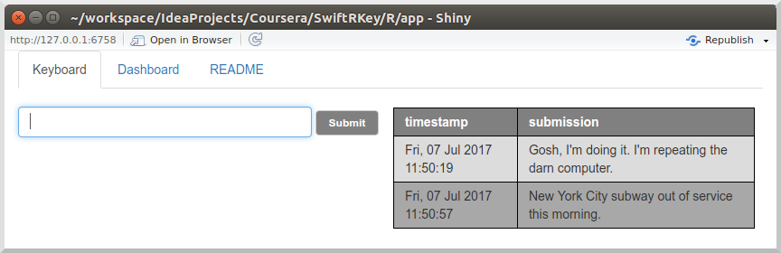
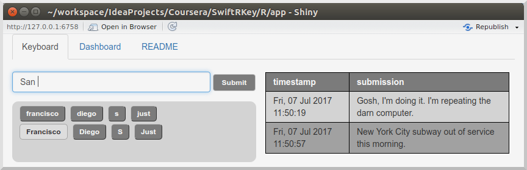
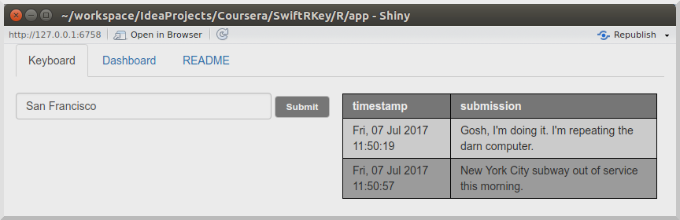
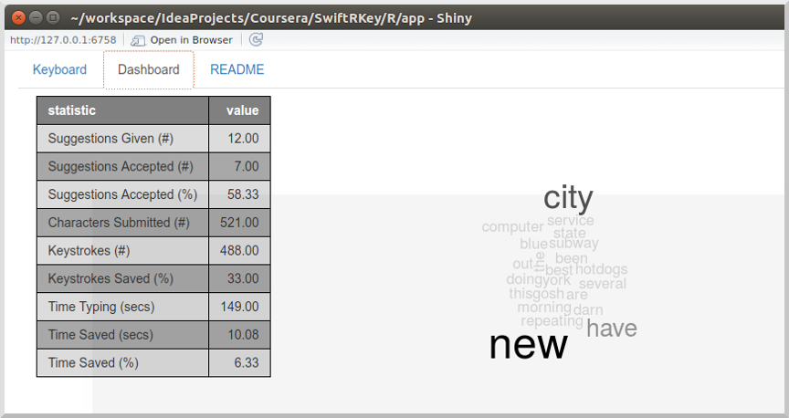
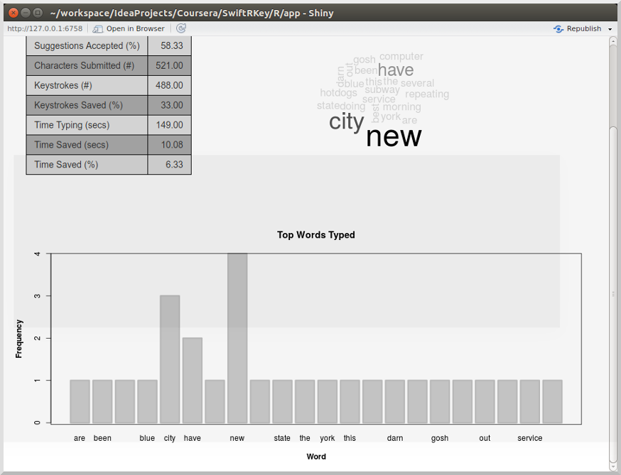
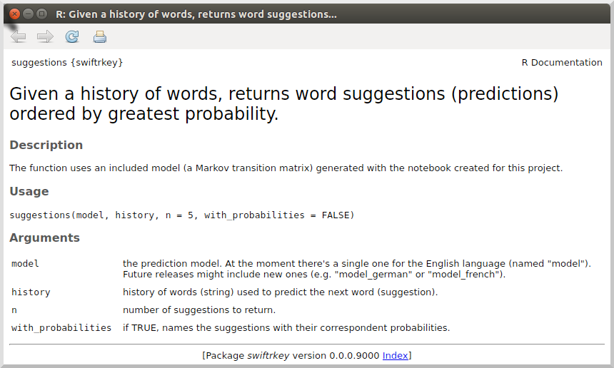

## Overview

The purpose of this app, which has been developed with the [Shiny Framework](https://shiny.rstudio.com/), is showing off a possible use for the [text predicting model created previously](../notebook/).

A demo of the SwiftRKey app can be found [here](https://marciogualtieri.shinyapps.io/swiftrkey/). It's important to note that the app has been deployed to [shinyapps.io](https://shinyapps.io) with a free account, thus there is a limit of 1Gb of memory, which somewhat restricts how sophisticated the application can be. I will detail its features in the sections that will follow.

For easy deployment, the model has been packaged as [a R library](../model) which can be easily reused in other Shiny applications or even in a R notebook.

## Shiny Application

### User Guide

#### Keyboard

Simply type the text you want to input and click the "Submit" button. Your input will be saved and shown in the table on the right. This table is cleaned up every two minutes by the way, but before the submitted text is cleaned up, the input information is aggregated into statistics that will displayed in the dashboard.

I've chosen to do that to cap the amount of memory and resources that are used by the app. Also, I don't see any advantage in keeping all messages given the purpose of this app (demoing the text prediction algorithm).



When a word followed by a white space is inputed, the words typed so far are used to predict the next word and suggestions are shown in the panel bellow the text input field. Just click the word of your choice (if any of the suggestions suits you) to have it appended to the text input field:





#### Dashboard

##### Statistics



The table on the right shows general keyboard usage statistics:

|Statistics              | Meaning                                                                                                              |
|------------------------|----------------------------------------------------------------------------------------------------------------------|
|Suggestions Given (#)   |Number of prediction attempts (suggestions) so far.                                                                   |
|Suggestions Accepted (#)|Numnber of suggestions that have been accepted by the user.                                                           |
|Suggestions Accepted (%)|Percentage of suggestions that have been accepted.                                                                    |
|Characters Submitted (#)|Number of characters submitted by the user.                                                                           |
|Keystrokes (#)          |Number of keystrokes performed by the user.                                                                           |
|Keystrokes Saved (%)    |Percentage of characters that were not typed by user, but came from suggestions accepted instead.                     |
|Time Typing (secs)      |Time spent inputing text.                                                                                             |
|Time Saved (secs)       |Estimate of how much more time the user would've spent inputing text if not using suggestions.                        |
|Time Saved (%)          |Time saved as a percentage. Int the screencap, "Time Saved (5): 6.3" means that the user spent 6.33% less time typing.|

According with the screencap, around 58% of the suggested words have been accepted, saving the user 33 keystrokes and 149 seconds that would've spent typing, thanks to the typing prediction feature. That demonstrably shows, in an quantitative way, that the feature is effective.

##### Frequency Plots

The dashboard also includes word frequency visualizations through a word cloud plot and a frequency barplot:



This information might give some insight about what are the most used words and help to create better models.

### Developer Guide

#### Architecture

The application has been designed following a [MVC Pattern](https://en.wikipedia.org/wiki/Model%E2%80%93view%E2%80%93controller). The following diagram illustrates the architecture:


<!---
custom_mark1
  digraph G {
    ShinyServer -> keyboard_controller;
    ShinyServer -> dashboard_controller;
    ShinyServer -> readme_controller;
    keyboard_controller [shape=box];
    dashboard_controller [shape=box];
    readme_controller [shape=box];
  }
custom_mark1
-->


<!---
custom_mark2
  digraph G {
    keyboard_view [shape=box];
    dashboard_view [shape=box];
    readme_view [shape=box];
    ShinyUI -> keyboard_view;
    ShinyUI -> dashboard_view;
    ShinyUI -> readme_view;
  }
custom_mark2
-->

In short, whatever code you put inside `ShinyUI()` is a view and whatever code you put inside `ShinyServer()` is a controller. That helps to keep the R files small and manageable.

#### Source Files

 **Controllers:**
            
            └── controllers
                ├── dashboard_controller.R (Dashboard showing typing statistics)
                ├── keyboard_controller.R  (The text input interface with next word prediction)
                └── readme_controller.R    (Shows this help age)

**Views:**
            
            └── views
                ├── dashboard_view.R
                ├── keyboard_view.R
                └── readme_view.R

**Shiny's standard Server and UI files:**
            
            ├── server.R 
            └── ui.R

**Global Code:**
            
            └── globals.R            (General app parameters and app state persistence code)


            ├── utils.R              (Utilities used by the keyboard and dashboard)
            └── apply_styles.R       (Applies CSS styles programatically for widgets that do 
                                      not support class as a parameter)

**Resources:**
            
            └── www
                ├── data
                │   └── epithets.txt (List of curse words for filter)
                └── style.css        (CSS styles for both the app and this readme file)

### How to Deploy the App

Before you can deploy to shinyapps.io, you need to set your account info:

```{r, eval = FALSE}
rsconnect::setAccountInfo(name='<USERNAME>',
                          token='<TOKEN>',
                          secret='<SECRET>')
```

You may get the full command, complete with your username/token/secret from the `Tokens` menu in shinyapps.io.

Once your account is set, you may deploy by runnning the following command:

```{r, eval = FALSE}
rsconnect::deployApp("/.../SwiftRKey/R/app",
                     appName = "swiftrkey")
```

## Prediction Model

### How to Deploy the Model

The model alone can be found on [GitHub](../model) as a R package. You may install it directly from GitHub with the `devtools` package:

```{r, eval = FALSE}
install.packages("devtools")
```

Once `devtools` has been installed, you may install the model using the following command:

```{r, eval = FALSE}
install_github("marciogualtieri/SwiftRKey", subdir="R/model/swiftrkey")
```

The model's package name is `swiftrkey`, which now can be loaded by the following command:

```{r}
suppressMessages(library(swiftrkey))
```

At the moment there's a single public function inside. For help, run the following command:

```{r}
?suggestions
```



### Example of Use

```{r}
suggestions(model, "new", n = 3)
```

```{r}
suggestions(model, "new york", n = 3)
```

If you want to know the probabilities for each suggestion, you may run the following command instead:

```{r}
suggestions(model, "new", n = 3, with_probabilities = TRUE)
```

The `model` object is a Markov transition matrix, which is loaded with the library by default. In future releases I may add other models, e.g. for different languages (like`model_german` and `model_french`) or generated by different methods (I have used Katz backoff, for more details refer to the [notebook](../notebook)).
