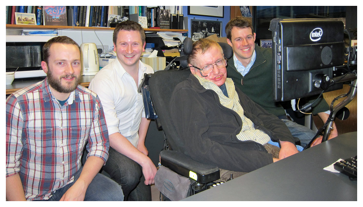
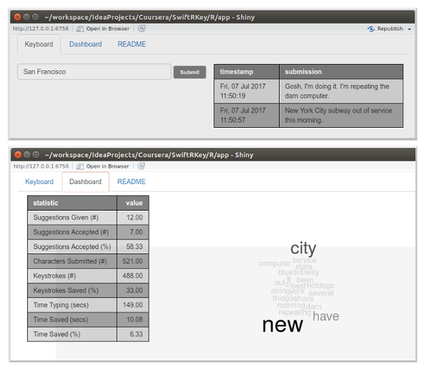

<center><h2>SwitftRKey</h2></center>
<center><h3>A Typing Prediction App Written in R</h3></center>
<center></center>
<center><h4>By Marcio Gualtieri</h4></center>
<center><h4>July 24, 2017</h4></center>

--- 

### Why Is Text Typing Prediction Useful?



<p>
The continued affordability and popularity of smart phones and other mobile devices pushed the advent of keyboard typing prediction.
</p>

<p>
Mobile devices are in general too small to fit a confortable size keyboard, making typing unpleasant.
</p>

<p>
This technology goes beyond providing a product to sell though: Professor Hawking's medical condition, amyotrophic lateral sclerosis (ALS), <a href = "https://blog.swiftkey.com/swiftkey-reveals-role-professor-stephen-hawkings-communication-system/"> makes text prediction critical to improve his daily live</a>.
</p>

<p>
A truly noble and remarkable use of technology which can have a positive impact in the lives of many other people with disabilities.
</p>

--- 

### How Does the Prediction Model Work?

The model is represented by a Markov transition matrix, where each cell contains the probability of a word given a history of words. The model has been encapsulated inside a package named `swiftrkey` together with the necessary supporting code:

```{r}
suppressMessages(library(swiftrkey))
model[10:12, 1:3]
```

Above, a partial view of the transition matrix's content. Each cell represents the probability of a word (each column) given a certain history of words (each row). For instance, given the row (history) "time", there is a 0.004030154 probability that the next word is "s".

---

Note that the history could be empty (first row) and that our model supports unknown words. Any word that isn't present in the model is treated as it was "&lt;unknown&gt;".

The probabilities have been calculated using Katz's Backoff. For more details refer to the [R notebook](https://marciogualtieri.github.io/SwiftRKey/R/notebook/swiftrkey.html).

You may easily deploy the model to your Shiny application or notebook by loading the library, and get suggestions by using the included supporting code:

```{r}
suggestions(model, "new", n = 2, with_probabilities = TRUE)
```

For more details refer to the [R package project](https://github.com/marciogualtieri/SwiftRKey/tree/master/R/master).

---

### The SwiftRKey App

The app (developed with the [Shiny Framework](https://shiny.rstudio.com/)) is comprised of a keyboard and a dashboard with statistics on the app's usage.




<p>
The metrics include measurements such as keystrokes saved by accepting suggestions, time saved not typing, a frequency barplot and a word cloud diagram to show the most popular words typed so far.
</p>

<p>
The app illustrates how the text prediction model can be easily incorporated into a useful app.
</p>

<p>
You will find more details in <a href = "https://github.com/marciogualtieri/SwiftRKey/tree/master/R/app">the app's documentation</a> and you may also demo the app <a href="https://marciogualtieri.shinyapps.io/swiftrkey/">here</a>.
</p>

<p>
<center><h3>THE END</h3></center>
</p>